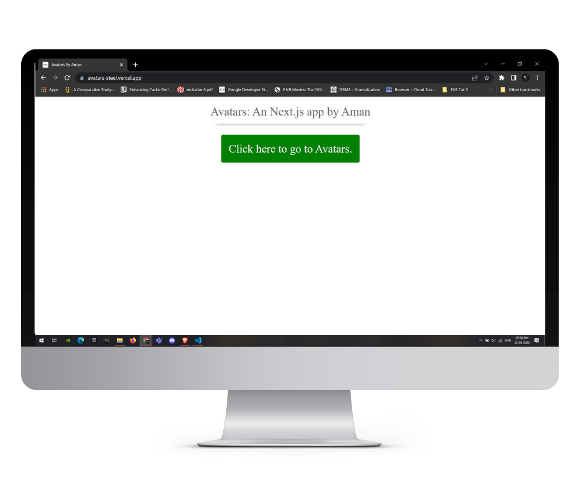

<div align="center">
  <h1 align="center"> Avatar</h1>
</div>

<h2>Check it our at: https://avatars-steel.vercel.app/</h2>

## About Avatar:
Avatar: The Last Airbender, also known as Avatar: The Legend of Aang in some regions, is an American anime-influenced animated television series produced by Nickelodeon Animation Studios. This is my very first Next.js application, I had been working with React.js for quite some time now and wanted to try out Next.js, so as an hands on learing experience I made this app.

## Screen Shots:
<div align="center">
  
  
  
  
</div>

### Steps to Run on Local Machine

***

#### Note: You need to have Node.Js installed in your Local Machine if not, first install it from <a href="https://nodejs.org/en/">here</a>.
##### Step 1) Clone AmanSinghBhogal/Avatars.
##### Step 2) Open Avatars cloned Directory in Command Prompt and run the following command (It will install all the Dependencies needed to run):
```
npm i
```
#### Step 3) Once all the dependencies are successfully installed, Run the following Command:
```
npm run dev
```
#### Step 4) Once the above steps are done you should get the message:
    You can now view client in the browser.
      Local:            http://localhost:3000 
      webpack compiled successfully
#### Step 5) Open Browser and go to http://localhost:3000

***

<h1 align="center">Thank You</h1>

***